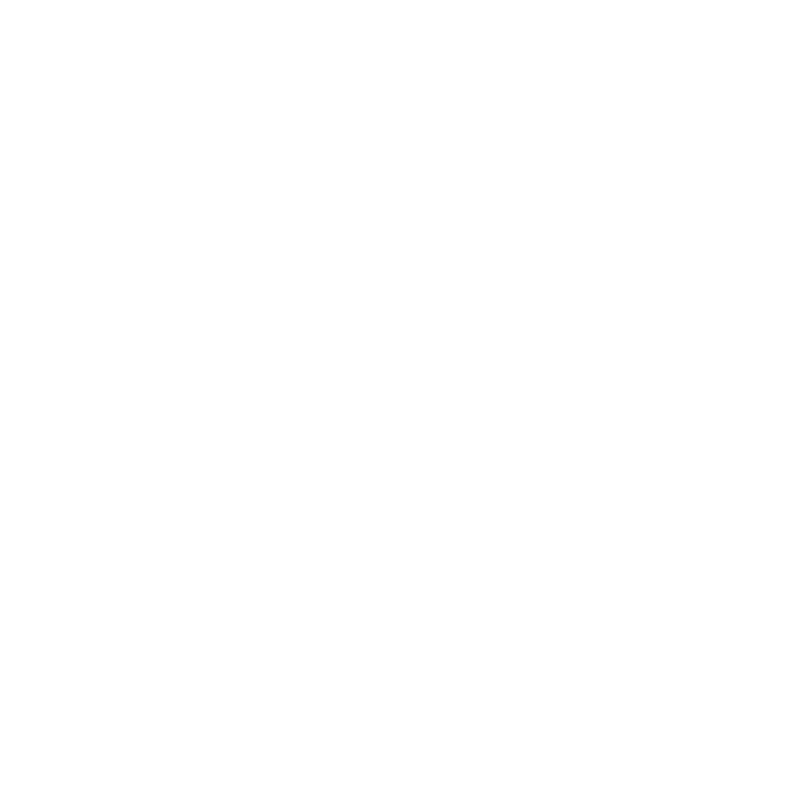

slidenumbers: true
slide-transition: true
theme: Work
autoscale: true

#  Migrating from UIKit to SwiftUI efficiently

```swift
final class MyViewController: UITableViewController {
    private var data = [String]()

    override func tableView(_ tableView: UITableView, cellForRowAt indexPath: IndexPath) -> UITableViewCell {
        let cell = tableView.dequeueReusableCell(withIdentifier: "cell")
        let d = data[indexPath.row]
        cell?.textLabel?.text = d

        return cell ?? UITableViewCell()
    }

    override func tableView(_ tableView: UITableView, numberOfRowsInSection section: Int) -> Int {
        return data.count
    }
}

         ↓

struct MyView: View {
    private var data = [String]()

    var body: some View {
        List(data, id: \.self) { d in
            Text(d)
        }
    }
}
```

^ 効率よくUIKitからSwiftUIへ移行する
^ SwiftUIが出て、大きなパラダイムシフトになっています。弊社アプリのObjective-C -> Swift移行の知見を活かし、失敗せずにUIKitからSwiftUIへ移行するためのアドバイスと考察した内容を共有させていただきたいと思います。
^ I realized I wanted to put code in my presentation, so I put it here :)

---

# Self Intro
* Name: Joshua Kaplan
* Work: minne @ GMO Pepabo
* Interests: 🤖CI/CD, 📦frameworks, and more
* Hobbies: 🥯bread, 📚history, and 🏃running

^ Sorry if I get anything wrong. I only have about 1 year of SwiftUI experience

---

# Intro
1. Why move to SwiftUI?
2. Why not move to SwiftUI?
3. Modernize Swift Usage
4. Modernize UIKit usage
5. Plan and prototype
6. Two approaches

---

# Why move to SwiftUI
* Do *more* with *less* code (for most things)
* *Easier* to implement
* The *future* of GUI development

^ * accessibility
^  * Dynamic text, etc
^ * dark/light mode support
^ * default layouts and margins
^ * support for UIs on different Apple platforms

---

# Why not move to SwiftUI
* Stability
* _iOS 12_ and less compatibility
* Low-level or high performance needs
* Mixing can be difficult and painful without planning
* How urgent?

^ Navigation
^ Bugs
^ Changes in behavior between iOS/macOS versions
^ EG: IoT, video playback app

---

# Modernize Swift usage
* Migrate from Objective-C!
* Use _latest_ Swift version
* Use _Swiftier_ conventions
* Use all the latest features
* Get familiar with _FRP_ frameworks

^ Value types, POP, and FP
^ Combine, Rx, or Reactive
^ Become familiar like property wrappers

---

# Modernize UIKit usage
* Use auto layout
* Support safe area
* Components
* Thin or no storyboards
* Dynamic type and dark mode
* Use *declarative* UIKit APIs

^ Splitting into separate xibs at least
^ StackViews
^ CompositionalLayout
^  * back port available
^ DiffableDataSources
^  * backport available
^ Most screens these days can be implemented with collection view or stack view, and would even benefit

---

#  Plan and prototype

---

## Prototype
* Make a prototype
* Identify screens/components not suited to SwiftUI
* Change the design
* Make an iOS 13-only feature

^ Make a totally new prototype app for your domain: EC app, notes app, etc

---

##  Architecture
* Redux
* [The Composable Architecture (TCA)](https://github.com/pointfreeco/swift-composable-architecture)
* MVVM

^ Experiment with architectures that work particularly well w/ SwiftUI

---

# Two approaches

---




^ What is UIKit and SwiftUI base
^ Why I recommend UIKit base
^ Highest up the view tree to lowest
^ Navigation done in UIKit
^ TabBar, AppDelegate/SceneDelegate last

---

# Conclusion
* Don't mix too much
* Start with _easier_ screens
* Don’t hurry
* Make plans
* _Study_ SwiftUI and Combine

^ Detailed, written plans
^ Better to think first
^ But don’t put it off too long
^ Don’t bite off more than you can chew
^ Choose screens that could particularly benefit and result in less code like List views and Forms
^ 本番のアプリでSwiftUIに移行する前に、しっかりと準備することで、より効率よく移行ができ、より品質の高いコードを書けるようになると思うので、ぜひ先ほどの内容が参考になればと思います。多くの場合、SwiftUIのおかげで仕事が前より楽になるので、ワクワク感を持って、進みましょう！

---

# Thank you

---

# Reference

---

# Prototype

* [Shop.app](https://github.com/yhkaplan/shop)

---

# Combine

---

# Docs
- [Official Documentation](https://developer.apple.com/documentation/combine)
- [RxSwift to Combine Cheatsheet](https://github.com/CombineCommunity/rxswift-to-combine-cheatsheet)
- [Combineフレームワークまとめ](https://qiita.com/shiz/items/5efac86479db77a52ccc)

---

# Code
- [CombineSwiftPlayground](https://github.com/AvdLee/CombineSwiftPlayground)
- [Combine-MVVM](https://github.com/mcichecki/Combine-MVVM)
- [OpenCombine](https://github.com/OpenCombine/OpenCombine)

---

# Video
- [Introducing Combine](https://developer.apple.com/videos/play/wwdc2019/722/)
- [Combine in Practice](https://developer.apple.com/videos/play/wwdc2019/721/)

---

# Books
- [Using Combine](https://heckj.github.io/swiftui-notes/)
- [Practical Combine](https://practicalcombine.com/)
- [Understanding Combine](https://www.apeth.com/UnderstandingCombine/toc.html)
- [Combine: Asynchronous Programming with Swift](https://store.raywenderlich.com/products/combine-asynchronous-programming-with-swift)

---

# SwiftUI

- [Official Documentation](https://developer.apple.com/xcode/swiftui/)

---

# Books
- [Thinking in SwiftUI](https://www.objc.io/books/thinking-in-swiftui/)
- [SwiftUI by Tutorials](https://store.raywenderlich.com/products/swiftui-by-tutorials)
