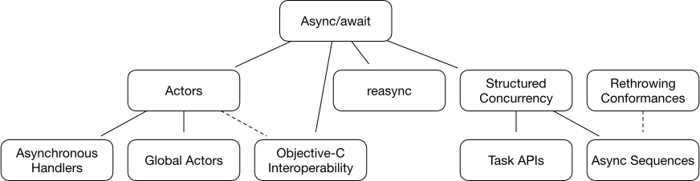

slidenumbers: true
slide-transition: true
theme: Work
autoscale: true

# Swift and Concurrency

## The Plan for World Domination

---

# Domains

- **Apple platform GUI apps**
- Server-side
- Machine Learning
- Systems Programming
- 🌍**World Domination**⚔️

^ 10th on Tiobe Index, behind C++ and Java but ahead of Go, Rust, etc

---

# What is Concurrency

- Parallel
  - Doing multiple pieces of work at the same time
- Async
  - Work that doesn't block the calling thread
- Concurrency
  - Doing more than one piece of work at a time, with overlapping and non-overlapping work
  - Preventing unnessary waiting
- Atomicity/atomic/non-atomic

> Atomicity is a safety measure which enforces that operations do not complete in an unpredictable way when accessed by multiple threads or processes simultaneously.

- [source](https://www.vadimbulavin.com/atomic-properties/)

^ 不可分性 / アトミック性

---

# Why concurrency

- Performance
- Responsive UI
- More cores, fewer clock-speed improvements

---

# Common Problems

* Readability/Maintainability
* Performance
    * Thread-switching cost
    * Memory usage
* Bugs
    * Data races
    * Deadlock

---

# Current State

- ✅ Threads, semaphores, and locks
- ✅ Queues & DispatchGroups
- ✅ Callbacks
- ✅ Reactive/FRP (RxSwift, Combine, ReactiveSwift)
- ✅ Promises (SwiftNIO, PromiseKit, Combine.Future)
- ⏳ General Concurrency (Tasks)
- ⏳ Async/await
- ⏳ Actors

---

# New Features

- [Roadmap](https://forums.swift.org/t/swift-concurrency-roadmap/41611)

* Async/Await
* Tasks
* Actor Model

---

# Async/await

---

- Callbacks (completion handlers) are
  - complex
  - error-prone

```swift
func processImageData(completion: @escaping (Image?) -> Void) {
  loadWebResource("data-url") { dataResult in
    guard case let .success(data) = dataResult else {
      completion(nil)
      return
    }
    loadWebResource("image-url") { imageResult in
      // I got tired of typing
    }
  }
}
```

---

- Write asynchronous code as if it were synchronous
- Succint and easy to reason about

```swift
func processImageData() async throws -> Image {
  let dataResource = try await loadWebResource("some-url")
  let imageResource = try await loadWebResource("another-url")
  let imageTmp = try await decodeImage(dateResource, imageResource)
  let imageResult = try await resizeImage(image)
  return imageResult
}
```

^ Much the same as in other languages

---

# General Concurrency

- What's wrong w/ this code?

```swift
func makeDinner() async throws -> Meal {
  let veggies = try await chopVegetables()
  let meat = try await marinateMeat()
  let oven = try await preheatOven()

  let dish = Dish(ingredients: [veggies, meat])
  return try await oven.cook(dish)
}
```

---

- It's not concurrent
- Waiting for each step to finish
- Let's fix it!

---

- `async let` makes separate, concurrently executing child tasks
- All async functions run as part of an async /task/
  - Carry schedule info like priority and act as interface for cancellation and such
- Try is written at call-site of the constant
- On completion, the constants are initialized

```swift
func makeDinner() async throws -> Meal {
  async let veggies = chopVegetables()
  async let meat = marinateMeat()
  async let oven = preheatOven()

  let dish = Dish(ingredients: await [try veggies, meat])
  return try await oven.cook(dish)
}
```

---

# Actors

* Eliminate data races w/ compiler checks
* Set of limitations called `actor isolation`
    * For example, instance properties can only be accessed on `self`
    * Conversely, immutable value type properties don’t require isolation
    * To call an instance method that mutates self, make that method `async`

---

# Swift's Actor isolation plan

1. Basic isolation model
  * For _value types only_
  * value types are true copies and not references to the original object in memory, therefore, safer to deal with
2. Then full isolation model
  * for state in _reference types_ etc

---

# Actor classes

- Add `actor` keyword before class
- Atomic updates
- Enforce /actor isolation/ on mutable instance properties
- Internally, each class instance has something like its own queue

```swift
actor class BankAccount {
  // imagine this
  // private let backAccountQueue = DispatchQueue(name: "BankAccount", qos: .background)

  private let ownerName: String
  private var balance: Double

  // requires async
  func transfer(amount: Double, to other: BankAccount) async throws {
    balance = balance - amount
    await other.deposit(amount: amount)
  }
}
```

---

# Global actor

* Don’t require limiting an actor to a specific class
* Annotations that can be fixed to variables and functions
* Singleton actor that **only** has one instance of a global actor in a given process
	* EG: `@UIActor` for main thread
* actor classes on the other hand can have many instances

```swift
// Usage
@UIActor func showUsers() {}

// Definition
@globalActor struct UIActor {
  static let shared = SomeActorInstance()
}
```

---

# Languages and frameworks with Actors

- [Akka framework (Scala)](http://akka.io/)
- [Erlang](https://www.erlang.org/)
- [Pony](https://www.ponylang.org/)

---

# Language Comparison

- Go
    - Goroutines, locks, wait groups and more
- Rust
    - Borrow checker has great guarentees
    - Async/await, locks, channels
    - Verbose and less declarative (lower-level "older-brother" to Swift)

- [Source](https://gist.github.com/lattner/31ed37682ef1576b16bca1432ea9f782#go)

^ Swift actors are higher level and more declarative according to Lattner https://gist.github.com/lattner/31ed37682ef1576b16bca1432ea9f782#go

---

# Go Example


```go
// Worker represents the worker that executes the job
type Worker struct {
  WorkerPool  chan chan Job
  JobChannel  chan Job
  quit        chan bool
}

func NewWorker(workerPool chan chan Job) Worker {
  return Worker{
    JobChannel: make(chan Job),
    quit:       make(chan bool)}
}

func (w Worker) Start() {
  go func() {
    for {
      select {
      case job := <-w.JobChannel:
        // ...
      case <-w.quit:
        // ...
      }
    }
  }()
}

// Stop signals the worker to stop listening for work requests.
func (w Worker) Stop() {
  go func() {
    w.quit <- true
  }()
}
```

- I think something similar can be done w/ `sync.WaitGroup`
- [Source](https://gist.github.com/lattner/31ed37682ef1576b16bca1432ea9f782#go)

---

# In Swift?

```swift
actor class Worker {
  func do(job: Job) async {
    // ...
  }

  func stop() async {
    // ...
  }
}
```

* Also, Swift has generics 🙃
- [Source](https://gist.github.com/lattner/31ed37682ef1576b16bca1432ea9f782#go)

---

# Conclusion

- Swift will jump to a top-class concurrent language, making it even better for Apple GUI platform development
    - Apple's push for distributed systems
- Swift's complexity will increase, so hopefully the pace will slow down after concurrency
    - `Progressive disclosure` helps
    - Worrying "Which feature to use?" is both a joy and a curse
- Swift won't replace Go, Rust, Java, Ruby etc, but instead complement them more
- More choice of concurrent-savvy languages is a win for us all
- If successful on Swift, Actors may spread to new languages

---

- If interested, try Swift!

---

# Reference

- [2017 Swift Concurrency Manifesto](https://gist.github.com/lattner/31ed37682ef1576b16bca1432ea9f782)
- [Forums](https://forums.swift.org/tag/concurrency)
- [Roadmap](https://forums.swift.org/t/swift-concurrency-roadmap/41611)
- [Async/await](https://github.com/apple/swift-evolution/blob/main/proposals/0296-async-await.md)
- [Structured Concurrency](https://github.com/DougGregor/swift-evolution/blob/structured-concurrency/proposals/nnnn-structured-concurrency.md)
- [Actors & actor isolation](https://github.com/DougGregor/swift-evolution/blob/actors/proposals/nnnn-actors.md)
- [Actor memory isolation for “global” state](https://forums.swift.org/t/actor-memory-isolation-for-global-state/42311)
- [“Actors are reference types, but why classes?”](https://forums.swift.org/t/actors-are-reference-types-but-why-classes/42281)
- [Evolving the Concurrency design and proposals](https://forums.swift.org/t/concurrency-evolving-the-concurrency-design-and-proposals/42184)
- [Merged code](https://github.com/apple/swift/tree/main/stdlib/public/Concurrency)
- [Concurrency Roadmapから垣間見るSwiftの未来の一側面](https://speakerdeck.com/shiz/concurrency-roadmap-5264bd70-2a7a-41f8-a412-438df70f0233)

---

# Dependencies



- [Source](https://gist.github.com/DougGregor/444575ac67cbd25bfc4b1d4fd241ae93#file-swiftconcurrencydependencies-svg)
