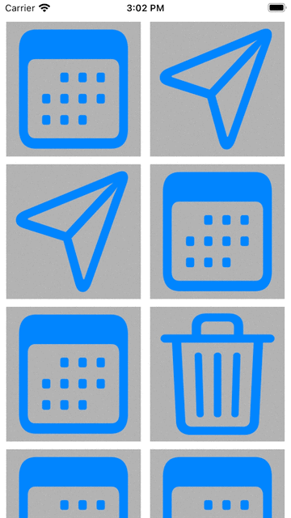
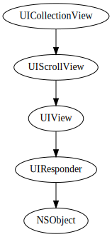
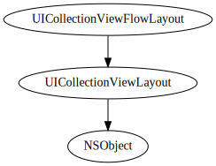
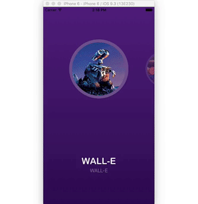
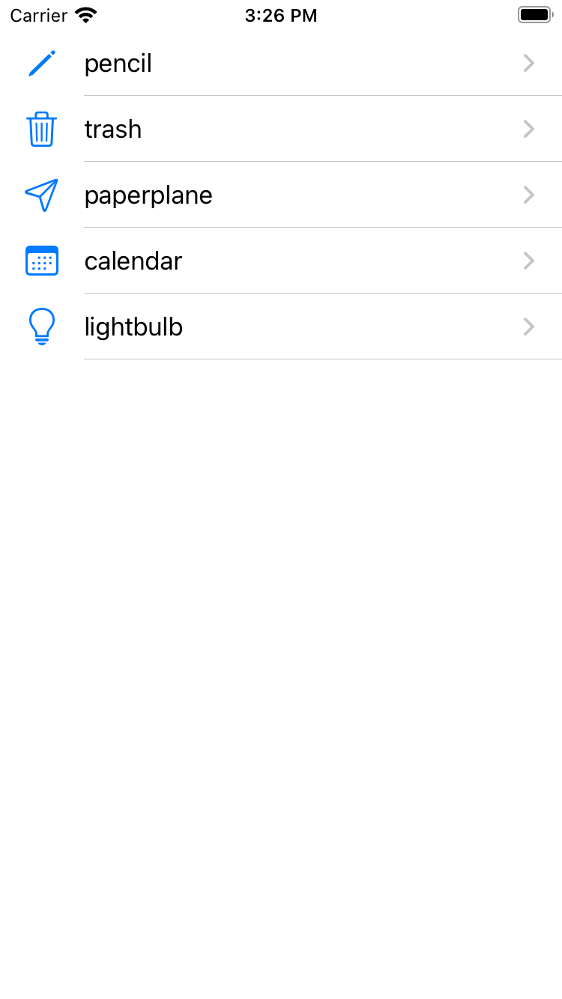
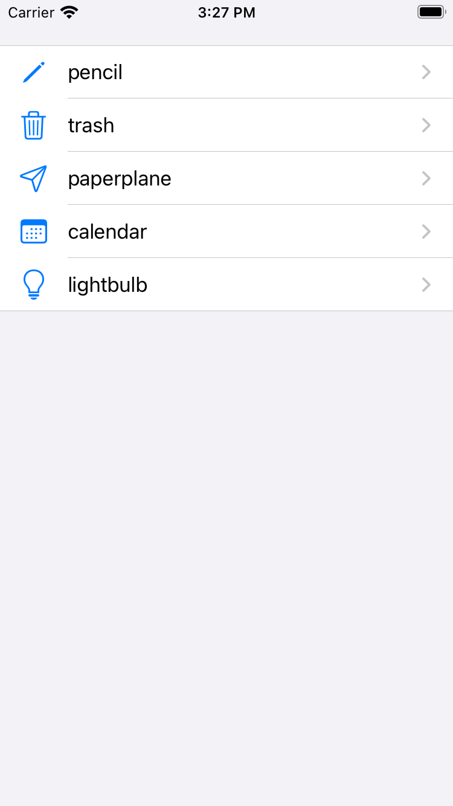
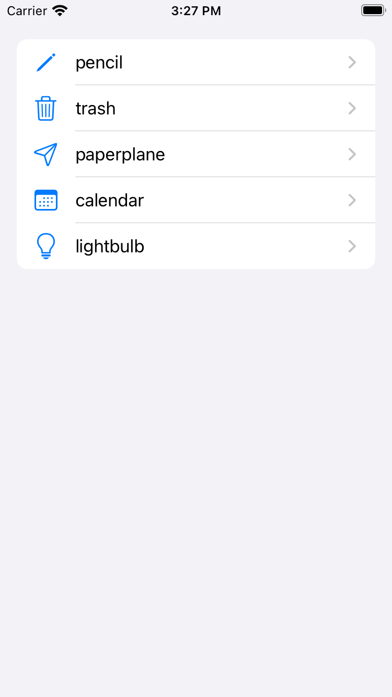
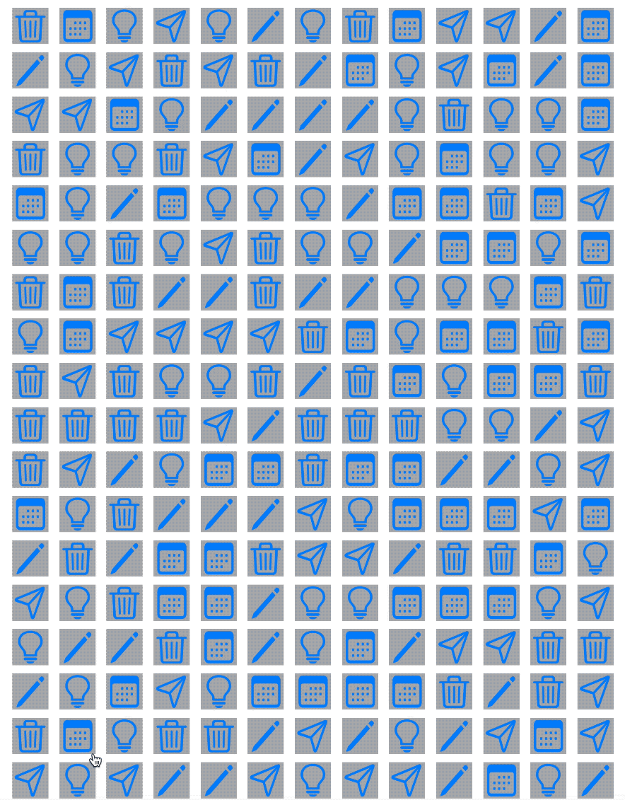

slidenumbers: true
slide-transition: true
theme: Work
autoscale: true

# Using the latest UICollectionView APIs

---

## TOC

* Intro
* Topics skipped
* Layout
* Data and Cell Configuration
* Future Directions
* References and Miscellaneous

---

## Intro

- Joshua Kaplan (`yhkaplan`)
- Senior iOS Engineer @ GMO Pepabo working on *minne*
- Tooling, frameworks, and architecture
- Stay-at-home shiba-inu parent


---

## Topics skipped

* Drag and drop
* Cell editing
* Headers and footers
* Prefetching
* Dynamic layout transitions

---

# Layout

---

## Definition

- Standard Grid
- Difference w/ UITableView
- Manages multiple scrolling views
    - **completely configurable** layout
    - High performance, view recycling

 

^explanation of why it's so imperative and when it was made public

---

## Basic Grid

- UICollectionViewFlowLayout
- Define in code UICollectionViewFlowLayout or delegate, or interface builder



---

```swift
final class CollectionViewBasicsVC: UIViewController {
    private lazy var data = (0...100).compactMap { _ in
        ["pencil", "trash", "paperplane", "calendar", "lightbulb"].randomElement()
    }
    private lazy var layout: UICollectionViewFlowLayout = {
        let l = UICollectionViewFlowLayout()
        let halfWidth = view.bounds.width / 2
        let halfWidthMinusMargins = halfWidth - 14
        let height = halfWidthMinusMargins
        l.itemSize = CGSize(width: halfWidthMinusMargins, height: height)
        return l
    }()
    private lazy var collectionView = UICollectionView(frame: view.bounds, collectionViewLayout: layout)


    override func viewDidLoad() {
        super.viewDidLoad()

        view.addSubview(collectionView)

        collectionView.contentInset = UIEdgeInsets(top: 8, left: 8, bottom: 8, right: 8)
        collectionView.backgroundColor = .white
        collectionView.register(BasicCell.self, forCellWithReuseIdentifier: BasicCell.reuseID)
        collectionView.dataSource = self
    }
}

extension CollectionViewBasicsVC: UICollectionViewDataSource {
    func collectionView(_ collectionView: UICollectionView, numberOfItemsInSection section: Int) -> Int {
        data.count
    }

    func collectionView(_ collectionView: UICollectionView, cellForItemAt indexPath: IndexPath) -> UICollectionViewCell {
        let cell = collectionView.dequeueReusableCell(withReuseIdentifier: BasicCell.reuseID, for: indexPath)

        let systemName = data[indexPath.item]
        if let image = UIImage(systemName: systemName) {
            (cell as? BasicCell)?.configure(with: image)
        }
        return cell
    }
}
```

---

## Completely configurable🤔

- Not just basic grids!
- Lists, complex grids, 3D stacks, carousels, or anything

---

## Examples

---

## Spinner

- [jVirus/uicollectionview-layouts-kit](https://github.com/jVirus/uicollectionview-layouts-kit)


---

## Safari

- [jVirus/uicollectionview-layouts-kit](https://github.com/jVirus/uicollectionview-layouts-kit)


---

## Carousel

- [zepojo/UPCarouselFlowLayout](https://github.com/zepojo/UPCarouselFlowLayout)



---

## BounceyLayout

- [GitHub - roberthein/BouncyLayout: Make. It. Bounce.](https://github.com/roberthein/BouncyLayout)


---

## List

- iOS 14+
- Part of CompositionalLayout
- All main styles available

  

---

```swift
final class ListVC: UIViewController {
    enum Section: Hashable { case list }

    private let data = ["pencil", "trash", "paperplane", "calendar", "lightbulb"]

    private lazy var collectionView = UICollectionView(frame: view.bounds, collectionViewLayout: layout)
    private lazy var layout: UICollectionViewCompositionalLayout = {
        let config = UICollectionLayoutListConfiguration(appearance: .plain)
        return UICollectionViewCompositionalLayout.list(using: config)
    }()
    private lazy var dataSource = UICollectionViewDiffableDataSource<Section, String>(
        collectionView: collectionView
    ) { collectionView, indexPath, item in
        let registration = UICollectionView.CellRegistration<UICollectionViewListCell, String> { cell, indexPath, item in
            var content = cell.defaultContentConfiguration()
            content.image = UIImage(systemName: item)
            content.text = item
            cell.contentConfiguration = content
        }

        let cell = collectionView.dequeueConfiguredReusableCell(using: registration, for: indexPath, item: item)
        cell.accessories = [.disclosureIndicator()]

        return cell
    }

    override func viewDidLoad() {...}
}
```

---

## CompositionalLayout

- Complex, grouped sections
- Convenient for future proofing simpler views


---

## Code

```swift
final class BasicCompositionalLayoutGridVC: UIViewController {
    enum Section: Hashable { case grid }

    private let data = ["pencil", "trash", "paperplane", "calendar", "lightbulb"]

    private lazy var collectionView = UICollectionView(frame: view.bounds, collectionViewLayout: layout)
    private lazy var layout = UICollectionViewCompositionalLayout { sectionIndex, environment in
        let itemSize = NSCollectionLayoutSize(widthDimension: .fractionalWidth(0.5), heightDimension: .fractionalHeight(1.0))
        let item = NSCollectionLayoutItem(layoutSize: itemSize)
        item.contentInsets = NSDirectionalEdgeInsets(top: 4, leading: 4, bottom: 4, trailing: 4)

        let groupSize = NSCollectionLayoutSize(widthDimension: .fractionalWidth(1.0), heightDimension: .fractionalWidth(0.5))
        let group = NSCollectionLayoutGroup.horizontal(layoutSize: groupSize, subitems: [item])

        return NSCollectionLayoutSection(group: group)
    }
    private lazy var dataSource = UICollectionViewDiffableDataSource<Section, String>(collectionView: collectionView) {...}

    override func viewDidLoad() {...}
}
```

---

## Custom Layout

- Subclass UICollectionViewFlowLayout or UICollectionViewLayout
- Procedural and verbose
- Powerful
- UIKitDynamics
- Easy to pop-in OSS layouts



---

```swift
open class BouncyLayout: UICollectionViewFlowLayout {
    lazy var dynamicAnimator = UIDynamicAnimator(collectionViewLayout: self)
    var latestDelta: CGFloat = 0.0
    var visibleIndexPaths: Set<IndexPath> = []

    override init() {...}
    required public init?(coder: NSCoder) {...}

    override open func prepare() {
        super.prepare()

        // Need to overflow our actual visible rect slightly to avoid flickering.
        guard let collectionView = collectionView else { return }

        let rect = CGRect(origin: collectionView.bounds.origin, size: collectionView.frame.size)
        let visibleRect = rect.insetBy(dx: -100.0, dy: -100.0)
        guard let itemsInVisibleRect = super.layoutAttributesForElements(in: visibleRect) else { return }
        let itemsIndexPathsInVisibleRect: Set<IndexPath> = Set(itemsInVisibleRect.map { $0.indexPath })

        // Step 1: Remove any behaviors that are no longer visible.
        let noLongerVisibleBehaviors = dynamicAnimator.behaviors.filter { behavior in
            guard
                let behaviorItem = (behavior as? UIAttachmentBehavior)?.items.first,
                let layoutAttribute = behaviorItem as? UICollectionViewLayoutAttributes
            else { return false }

            return !itemsIndexPathsInVisibleRect.contains(layoutAttribute.indexPath)
        }

        noLongerVisibleBehaviors.forEach { behavior in
            dynamicAnimator.removeBehavior(behavior)
            if let layoutAttribute = (behavior as? UIAttachmentBehavior)?.items.first as? UICollectionViewLayoutAttributes {
                visibleIndexPaths.remove(layoutAttribute.indexPath)
            }
        }

        // Step 2: Add any newly visible behaviors.
        // A "newly visible" item is one that is in the itemsInVisibleRect(Set|Array) but not in the visibleIndexPathsSet
        let newlyVisibleItems = itemsInVisibleRect.filter { !visibleIndexPaths.contains($0.indexPath) }
        let touchLocation = collectionView.panGestureRecognizer.location(in: collectionView)

        newlyVisibleItems.forEach { item in
            var center = item.center
            let springBehavior = UIAttachmentBehavior(item: item, attachedToAnchor: center)

            springBehavior.length = 0.0
            springBehavior.damping = 0.8
            springBehavior.length = 1.0

            // If our touchLocation is not (0,0), we'll need to adjust our item's center "in flight"
            if CGPoint.zero != touchLocation {
                let yDistanceFromTouch = abs(touchLocation.y - springBehavior.anchorPoint.y)
                let xDistanceFromTouch = abs(touchLocation.x - springBehavior.anchorPoint.x)
                let scrollResistance = (yDistanceFromTouch + xDistanceFromTouch) / 1_500.0

                if latestDelta < 0 {
                    center.y += max(latestDelta, latestDelta * scrollResistance)
                } else {
                    center.y += min(latestDelta, latestDelta * scrollResistance)
                }
                item.center = center
            }

            dynamicAnimator.addBehavior(springBehavior)
            visibleIndexPaths.insert(item.indexPath)
        }
    }

    open override func layoutAttributesForElements(in rect: CGRect) -> [UICollectionViewLayoutAttributes]? {
        return dynamicAnimator.items(in: rect) as? [UICollectionViewLayoutAttributes]
    }

    open override func layoutAttributesForItem(at indexPath: IndexPath) -> UICollectionViewLayoutAttributes? {
        return dynamicAnimator.layoutAttributesForCell(at: indexPath)
    }

    open override func shouldInvalidateLayout(forBoundsChange newBounds: CGRect) -> Bool {
        guard let collectionView = collectionView else { return false }
        let scrollView = collectionView

        let delta = newBounds.origin.y - scrollView.bounds.origin.y
        latestDelta = delta

        let touchLocation = collectionView.panGestureRecognizer.location(in: collectionView)

        dynamicAnimator.behaviors.forEach { behavior in
            guard let springBehavior = behavior as? UIAttachmentBehavior else { return }
            let yDistanceFromTouch = abs(touchLocation.y - springBehavior.anchorPoint.y)
            let xDistanceFromTouch = abs(touchLocation.x - springBehavior.anchorPoint.x)

            let scrollResistance = (yDistanceFromTouch + xDistanceFromTouch) / 1_500.0

            if let item = springBehavior.items.first as? UICollectionViewLayoutAttributes {
                var center = item.center
                if delta < 0 {
                    center.y += max(delta, delta * scrollResistance)
                } else {
                    center.y += min(delta, delta * scrollResistance)
                }
                item.center = center

                dynamicAnimator.updateItem(usingCurrentState: item)
            }
        }

        return false
    }
}
```

---

# Data and Cell Configuration

---

## DiffableDataSources

- Fits most cases
- iOS 14 and 15 added 
    - Cell/section reordering
    - Updating specific sections
    - Reloading completely w/o diff for better performance on large changes
- Animation behavior difficult to customize
- [SE-0240: Ordered Collection Diffing](https://github.com/apple/swift-evolution/blob/main/proposals/0240-ordered-collection-diffing.md) is your friend
    - Find inserted, deleted, and updated items/sections, then simply use [`performBatchUpdates(_:completion:)`](https://developer.apple.com/documentation/uikit/uicollectionview/1618045-performbatchupdates)

---

## Code

```swift
final class BasicCompositionalLayoutGridVC: UIViewController {
    enum Section: Hashable { case grid }

    private let data = ["pencil", "trash", "paperplane", "calendar", "lightbulb"]

    private lazy var collectionView = UICollectionView(frame: view.bounds, collectionViewLayout: layout)
    private lazy var layout = UICollectionViewCompositionalLayout {...}
    private lazy var dataSource = UICollectionViewDiffableDataSource<Section, String>(collectionView: collectionView) { collectionView, indexPath, item in
        let registration = UICollectionView.CellRegistration<UICollectionViewCell, String> { cell, indexPath, item in
            let image = UIImage(systemName: item)
            cell.contentConfiguration = ImageContentView.Config(image: image)
        }

        return collectionView.dequeueConfiguredReusableCell(using: registration, for: indexPath, item: item)
    }

    override func viewDidLoad() {
        super.viewDidLoad()

        view.addSubview(collectionView)

        var snapshot = NSDiffableDataSourceSnapshot<Section, String>()
        snapshot.appendSections([.grid])
        snapshot.appendItems(data, toSection: .grid)
        dataSource.apply(snapshot, animatingDifferences: false)
    }
}
```

---

## Cell configuration and updating

- Useful for UITableView-style cells
- Custom cells maybe more work than preferable

---

## List example

```swift
final class ListVC: UIViewController {
    enum Section: Hashable { case list }

    private let data = ["pencil", "trash", "paperplane", "calendar", "lightbulb"]

    private lazy var collectionView = UICollectionView(frame: view.bounds, collectionViewLayout: layout)
    private lazy var layout: UICollectionViewCompositionalLayout = {
        let config = UICollectionLayoutListConfiguration(appearance: .plain)
        return UICollectionViewCompositionalLayout.list(using: config)
    }()
    private lazy var dataSource = UICollectionViewDiffableDataSource<Section, String>(collectionView: collectionView) { collectionView, indexPath, item in
        let registration = UICollectionView.CellRegistration<UICollectionViewListCell, String> { cell, indexPath, item in
            var content = cell.defaultContentConfiguration()
            content.image = UIImage(systemName: item)
            content.text = item
            cell.contentConfiguration = content
        }

        let cell = collectionView.dequeueConfiguredReusableCell(using: registration, for: indexPath, item: item)
        cell.accessories = [.disclosureIndicator()]

        return cell
    }

    override func viewDidLoad() {...}
}
```
---

# Custom example

---

## UIContentView

```swift
final class ImageContentView: UIView, UIContentView {
    private var _configuration: Config
    private let imageView = UIImageView()

    var configuration: UIContentConfiguration {
        get { _configuration }
        set {
            guard let config = newValue as? Config else { return }
            _configuration = config
            imageView.image = _configuration.image
        }
    }

    init(config: Config) {
        _configuration = config
        super.init(frame: .zero)

        backgroundColor = .lightGray

        layoutImageView()
        imageView.image = _configuration.image
    }

    private func layoutImageView() {...}

    @available(*, unavailable)
    required init?(coder: NSCoder) {
        fatalError("init(coder:) has not been implemented")
    }

    struct Config: UIContentConfiguration {
        let image: UIImage?

        func makeContentView() -> UIView & UIContentView { ImageContentView(config: self) }
        func updated(for state: UIConfigurationState) -> ImageContentView.Config { self }
    }
}
```

---

## Registration

```swift
final class BasicCompositionalLayoutGridVC: UIViewController {
    enum Section: Hashable { case grid }

    private let data = ["pencil", "trash", "paperplane", "calendar", "lightbulb"]

    private lazy var collectionView = UICollectionView(frame: view.bounds, collectionViewLayout: layout)
    private lazy var layout = UICollectionViewCompositionalLayout {...}
    private lazy var dataSource = UICollectionViewDiffableDataSource<Section, String>(collectionView: collectionView) { collectionView, indexPath, item in
        let registration = UICollectionView.CellRegistration<UICollectionViewCell, String> { cell, indexPath, item in
            let image = UIImage(systemName: item)
            cell.contentConfiguration = ImageContentView.Config(image: image)
        }

        return collectionView.dequeueConfiguredReusableCell(using: registration, for: indexPath, item: item)
    }

    override func viewDidLoad() {...}
}
```

^ More thorough example with different content and background configurations on Apple's developer website

---

## Updating

- Update based on UICellConfigurationState
    - isSelected, isHighlighted, isDisabled, etc
- [`reconfigureItems(_:)`](https://developer.apple.com/documentation/uikit/nsdiffabledatasourcesnapshot/3804468-reconfigureitems)
- [`configurationUpdateHandler: UICollectionViewCell.ConfigurationUpdateHandler?`](https://developer.apple.com/documentation/uikit/uicollectionviewcell/3751733-configurationupdatehandler)

^ TODO: code example

---

# Future Directions

---

## SwiftUI

- List and Grid
- Performance
- Customizability

^ TODO: code example

---

## When to use UITableView

- complex list-style customization
- self-sizing cells w/ dynamic height are generally easier
- Consider using SwiftUI.List too

---

## Conclusion

- Find the right fit
- Older ways and SwiftUI work too
- You mostly don't need UITableView anymore
- UICollectionView is _really_ flexible and performant
- SwiftUI's Grid views are still somewhat lacking in comparison

---

## References and Miscellaneous

- Transitions and dynamically changing layout

### OSS Examples

* Various layouts
    * [jVirus/uicollectionview-layouts-kit](https://github.com/jVirus/uicollectionview-layouts-kit)
    * [amirdew/CollectionViewPagingLayout](https://github.com/amirdew/CollectionViewPagingLayout)
* Abstracting many layouts [WenchaoD/FSPagerView](https://github.com/WenchaoD/FSPagerView)
* Neat slanted layout [yacir/CollectionViewSlantedLayout](https://github.com/yacir/CollectionViewSlantedLayout)
* Abstraction based on delegates [airbnb/MagazineLayout](https://github.com/airbnb/MagazineLayout)

### UICollectionViewFlowLayout
* Easier than doing a custom layout from scratch
* Demo of making a custom layout like Pinterest
* 簡単なレイアウトなら、実装コストがより低いので、完全にカスタムなレイアウトを使うより好ましい

### Examples
* Pinterest-like layout [ChernyshenkoTaras/SquareFlowLayout](https://github.com/ChernyshenkoTaras/SquareFlowLayout)
* Carousel layout: [zepojo/UPCarouselFlowLayout](https://github.com/zepojo/UPCarouselFlowLayout)
*  UIKitDynamics [GitHub - roberthein/BouncyLayout: Make. It. Bounce.](https://github.com/roberthein/BouncyLayout)

### Comparison w/ SwiftUI.Grid
* Performance
* Custom scrolling and animation behavior
* Unusual layouts

* UIScrollViewDelegate

### Timeline

* 2016 or earlier / iOS 10
	* DataSourcePrefetching
* 2017 or earlier / iOS 11
	* drag and drop
* 2019 / iOS 13
	* DiffableDataSource
	* CompositionalLayout
* 2020 / iOS 14
	* cell configuration
	* UICollectionView list style
	* DiffableDataSource & CompositionalLayout new features
* 2021 / iOS 14.5
	* UIListSeparatorConfiguration
* 2021 / iOS 15
	* cell configuration new features
	*  DiffableDataSourceとCompositionalLayoutのさらなる進化

## Reference

* https://developer.apple.com/videos/play/wwdc2012/219/
* UIKit Dynamics
	* https://developer.apple.com/videos/play/wwdc2013/206/
	* https://developer.apple.com/videos/play/wwdc2013/221/
* https://developer.apple.com/documentation/uikit/uicollectionviewlayout
* [About iOS Collection Views](https://developer.apple.com/library/archive/documentation/WindowsViews/Conceptual/CollectionViewPGforIOS/Introduction/Introduction.html#//apple_ref/doc/uid/TP40012334-CH1-SW1)

## Miscellaneous
* Change layout dynamically
> To create an interactive transition—one that is driven by a gesture recognizer or touch events—use the  [startInteractiveTransition(to:completion:)](https://developer.apple.com/documentation/uikit/uicollectionview/1618098-startinteractivetransition)  method to change the layout object. That method installs an intermediate layout object, which works with your gesture recognizer or event-handling code to track the transition progress. When your event-handling code determines that the transition is finished, it calls the  [finishInteractiveTransition()](https://developer.apple.com/documentation/uikit/uicollectionview/1618080-finishinteractivetransition)  or  [cancelInteractiveTransition()](https://developer.apple.com/documentation/uikit/uicollectionview/1618075-cancelinteractivetransition)  method to remove the intermediate layout object and install the intended target layout object.
* https://developer.apple.com/documentation/uikit/uicollectionview/1618017-setcollectionviewlayout
* https://developer.apple.com/videos/play/wwdc2021/10252/